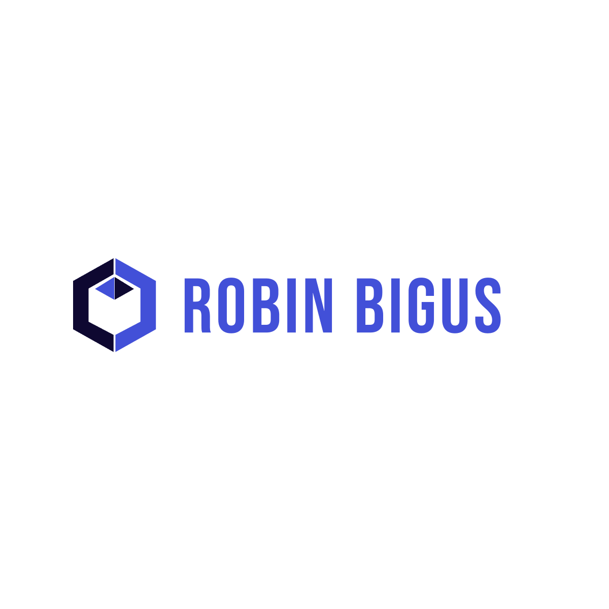

# Robin Bigus - Personal Website

This repository contains the source code for my personal website, showcasing my skills, experience, and projects as a Full Stack Web Developer.

## 🚀 Features

- **Responsive Design**: Fully responsive layout that works seamlessly across desktop, tablet, and mobile devices
- **Modern UI**: Clean and professional interface built with React and Tailwind CSS
- **Smooth Navigation**: Smooth scrolling between sections for a better user experience
- **Organized Content**: Clearly structured sections for About, Technologies, and Contact information

## 💻 Technologies Used

### Frontend

- React
- TypeScript
- Tailwind CSS
- React Icons

### Development Tools

- Vite (for fast development and optimized builds)
- Git (for version control)

## 📧 Contact

Feel free to reach out to me at robin.bigus1604@gmail.com or connect with me on [LinkedIn](https://www.linkedin.com/in/robin-bigus/) or [GitHub](https://github.com/RobinBigus).
